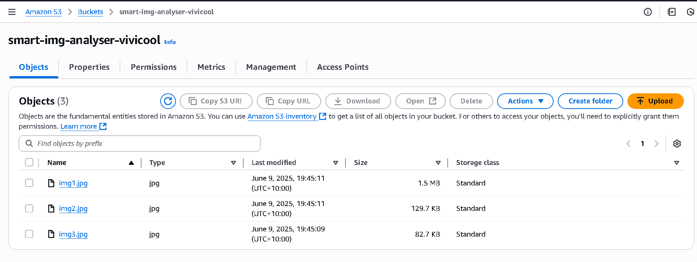

# Smart Image Analyser - guess who celebrities 😎 & what objects are those?

<a name="top"></a>
A Python tool that uses Amazon Rekognition to detect object labels and celebrity faces in images uploaded to S3.

**Why I Built This**

I made this project to play around with AWS Rekognition and see what it could do. It was really fun trying to guess which celebrity shows up in a photo - or what random objects it can detect! This helped me learn how to set up IAM permissions, connect to S3, and use Python to make it all work behind the scenes.

[👉 Let's jump to the RESULT! 📸](#result)

---

## Features

- Detects objects with bounding boxes
- Recognises celebrity faces
- Visual output using matplotlib
- Built with AWS Rekognition + S3 + Python

---

## Diagram


1. **Upload Image to S3 —** Using JPG/PNG format and upload to AWS S3 bucket.
2. **Analyse with Rekognition —** scans the image for labels (objects) and celebrities.
3. **IAM Grants Secure Access —** IAM handles permissions so it can access S3 and Rekognition.
4. **Python script calls AWS Rekognition** using AWS CLI and IAM credentials.
5. **Output is printed and visualised** with the script outputs labels, detected celebrities, and bounding boxes.

---

## Setup Requirements

### Install AWS CLI (If you don’t have one):

- Windows = https://docs.aws.amazon.com/cli/v1/userguide/install-windows.html
- Linux = https://docs.aws.amazon.com/cli/v1/userguide/install-linux.html
- MacOS = https://docs.aws.amazon.com/cli/v1/userguide/install-macos.html

### Create S3 Bucket

- Bucket name: `smart-image-analyzer`
- Region: e.g., `ap-southeast-2`
- Block public access: **Leave checked** (unless testing public access)
- Confirm "I acknowledge..." if unchecked
- Leave all other settings as default
- Click **Create bucket**



### Create IAM User

1. AWS Console > IAM > Users > Create user
2. Username: `rekognition-user` (or any name you like)
3. Permissions: Attach policies directly:
   - `AmazonS3FullAccess`
   - `AmazonRekognitionFullAccess`
4. Create access key for AWS CLI
5. Save Access Key ID and Secret Access Key securely:

   🔐 Access key ID

   🔐 Secret access key (only shown once!)


### Configure AWS CLI

```bash
aws configure
```

Enter (paste IAM user that you’ve created):

- Access Key ID
- Secret Access Key
- Region: `ap-southeast-2`
- Output: press Enter

AWS CLI on terminal now can access AWS services

```jsx
~ $ aws s3 ls
~ $ aws s3 ls s3://[*your-bucket-name*]
```


---

## Local Environment Setup

### Requirements:

- VS Code
- Python 3.11+
- pip

### Install packages:

```bash
pip install boto3 matplotlib pillow
```

---

## Folder Structure

```
smart-image-analyser/
├── images/         # local test images
├── results/        # output files
├── main.py         # main script
└── README.md
```

---

## Run the Script

Before running, make sure to update `main.py`:

```python
bucket = 'your-bucket-name'            # Replace with your S3 bucket name
images = ['img1.png', 'img2.png']      # Replace with your actual image filenames in S3
```

Then run:

```bash
python main.py
```

## Result

[🔼 Back to Top](#top)

Here’s what the output looks like when you run the script:


## How the Python Script Works

- Uses `boto3` to connect to AWS Rekognition and S3
- Downloads the image from S3
- Calls `detect_labels` to identify objects
- Calls `recognize_celebrities` to match faces
- Uses `matplotlib` to draw bounding boxes on detected items

---

## Troubleshooting

- If `boto3` or `matplotlib` not found:

```bash
python -m ensurepip --upgrade
python -m pip install boto3 matplotlib
```

- Check version:

```bash
python -m pip show boto3
python -m pip show matplotlib
```

- Ensure correct Python version is selected in VS Code (`Ctrl+Shift+P` → Python: Select Interpreter > choose 3.11 )

---

## Cleanup (To Prevent Charges)

- Delete image files from S3:
- Delete the S3 bucket
- Go to IAM:
  - Delete access keys
  - Detach or delete Rekognition & S3 permissions
  - Delete IAM user

---

## Notes

- You may be charged if you re-upload thousands of times (up to 5GB). The free tier allows 5GB storage and 2,000 uploads (PUT requests) per month. But it’s safe if you only upload a few images a few times

---

## What I learn and reflection

- I learned how to upload image files to an S3 bucket and analyse them using Rekognition.
- I set up an IAM user to access AWS CLI from the terminal in VS Code.
- IAM allows to controls who can access what in AWS services.
- I attached two key policies:
  - **`AmazonS3FullAccess`**– lets my script read images from S3 so Rekognition can process them
  - **`AmazonRekognitionFullAccess`**– allows my script to call Rekognition APIs like `detect_labels` and `recognise_celebrities`
